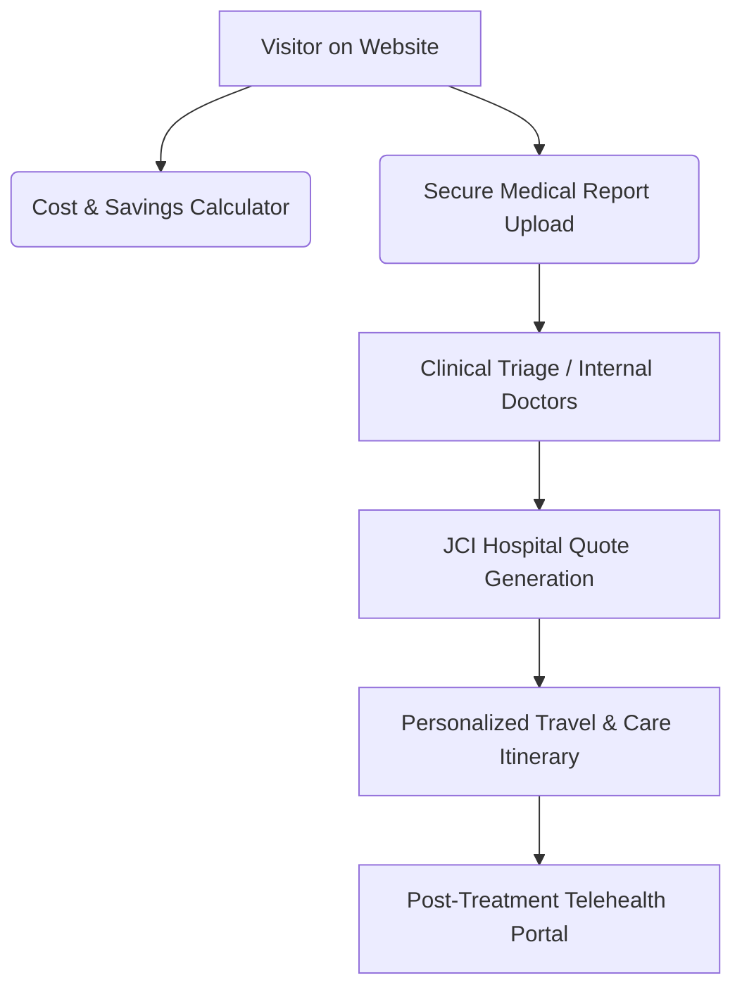

# Strategic Development and Marketing Plan: Santos Care (Heal India Medi Tourism)

This document outlines a comprehensive research-backed strategy for developing and marketing **Santos Care** (operating as *Heal India Medi Tourism*), leveraging its strategic base in Kochi, Kerala, to capture a significant share of the rapidly growing Indian medical tourism market.

---

## 1. Executive Summary
Santos Care ([santos.care](https://santos.care)) is positioned at the intersection of world-class, affordable clinical healthcare and high-end recuperative wellness. Operating from Kochi, Kerala—a region globally renowned for both advanced tertiary care and traditional Ayurveda—the project has a massive competitive advantage. By establishing a modern, secure patient portal, integrating holistic recovery packages, and targeting high-yield international markets (GCC, East Africa, Maldives, and self-pay Western markets), Santos Care can scale from a simple landing page into a leading medical value travel (MVT) facilitator.

---

## 2. Market Research: Medical Tourism in India & South India

The global medical tourism market is experiencing a massive post-pandemic resurgence, with India acting as one of the primary growth engines.

### Key Market Statistics
* **Market Valuation:** India’s medical tourism market was valued at **$7.69 Billion in 2024** and is projected to reach **$16.21 Billion by 2030**, growing at a CAGR of over **13%**.
* **Cost Differentials:** Treatments in India are **60% to 80% cheaper** compared to the US, UK, and Australia, and **30% to 40% cheaper** than in Thailand or Singapore, without any compromise on clinical outcomes.
* **Accreditations:** India houses over 40 Joint Commission International (JCI) accredited hospitals and over 1,000 National Accreditation Board for Hospitals & Healthcare Providers (NABH) accredited facilities.

### South India's Dominance: A Comparative Overview
South India represents the gold standard of Indian healthcare due to higher literacy rates, superior nursing standards, cleaner environments, and robust international air connectivity.

| Regional Hub | Primary Clinical Strengths | Key Competitive Advantage | Target Demographics |
| :--- | :--- | :--- | :--- |
| **Chennai** *(The Health Capital)* | Complex organ transplants, cardiac sciences, oncology, orthopedics. | High-volume clinical expertise; pioneering historical reputation. | Bangladesh, Middle East, Africa. |
| **Kochi / Kerala** *(The Wellness Hub)* | Cardiology, IVF, joint replacements, dental care, cosmetic surgery, and holistic rehabilitation (Ayurveda). | **Fusion of modern surgery and AYUSH wellness** for post-operative recovery; scenic recuperation. | GCC (Gulf), Maldives, Western Europe, East Africa. |
| **Bangalore** *(The Tech Capital)* | Robotic surgeries, neurosurgery, pediatric cardiology, advanced diagnostics. | Cutting-edge medical technology and IT-driven healthcare delivery. | US, UK, GCC. |

### The Kerala Advantage for Santos Care
Kochi is uniquely positioned to offer a **"Complete Healing Cycle"**:
1. **World-Class Infrastructure:** Home to premier JCI-accredited hospitals such as *Aster Medcity*, *Amrita Hospital*, *Rajagiri Hospital*, and *VPS Lakeshore*.
2. **Renowned Clinical Staff:** Kerala nurses and medical staff are globally coveted for their clinical competence and empathetic care.
3. **Recuperative Climate & Tourism:** Known as "God's Own Country," Kerala offers backwaters, hill stations, and Ayurveda resorts, making it ideal for the rehabilitation phase of treatment.
4. **Air Connectivity:** Kochi International Airport (COK) has direct, short-haul flights to all major GCC capitals, Singapore, and Europe.

---

## 3. Santos Care Platform Development Strategy

To turn the current static presence into a conversion-centric platform, the web interface and backend infrastructure must undergo a targeted development lifecycle.

### A. Technical Architecture & Tech Stack
To deliver speed, safety, and modern aesthetics, the following stack is recommended:
* **Frontend:** Next.js (App Router) for SEO optimization, server-side rendering, and fast load times.
* **Database & Auth:** Supabase (PostgreSQL) for secure user authentication and patient records.
* **Storage:** AWS S3 (HIPAA-compliant bucket settings) for storing sensitive medical documents, scans, and MRI reports.
* **Design Language:** Modern, clean UI utilizing soft teal, marine blue, and clean whites, emphasizing trust, hygiene, and calmness.

### B. Core Product Features


1. **Secure Document & MRI Viewer:**
   * Implement a secure portal where patients can upload heavy DICOM files (MRIs, CT scans) and PDF medical records.
   * Provide a HIPAA/GDPR-compliant dashboard for patients to view doctor opinions and hospital quotations.
2. **Interactive Cost & Savings Calculator:**
   * A dynamic widget comparing the cost of surgeries (e.g., bypass, knee replacement, IVF) in the US/UK vs. India.
   * Include estimated costs for flights, 3-star/5-star accommodation, and local transport, visualizing the exact net savings.
3. **Interactive Hospital & Doctor Directory:**
   * Build a database of partnered JCI & NABH hospitals in Kochi.
   * Allow patients to filter doctors by specialty, years of experience, and languages spoken (highly critical for Arabic, French, and Swahili-speaking patients).
4. **The "Surgery + Wellness" Package Builder:**
   * Let patients bundle their clinical treatment (e.g., knee replacement) with a post-op Ayurvedic rehabilitation package in Munnar or Kumarakom backwaters, creating an all-in-one recuperation itinerary.

---

## 4. Santos Care Marketing & Patient Acquisition Strategy

Marketing a medical tourism platform requires building high trust and addressing patient anxiety regarding travel, quality of care, and legal recourse.

### A. Geographic Targeting Strategy

> [!IMPORTANT]
> To maximize ROI, marketing spend should be focused on specific geographical corridors with direct flight links to Kochi.

* **Corridor 1: The GCC (Gulf Cooperation Council) - Oman, UAE, Qatar, Saudi Arabia, Bahrain**
  * *Target:* Both local Arab citizens (seeking high-end private care without long waitlists) and the massive South Asian diaspora.
  * *Focus:* Cardiology, Orthopedics, Executive Health Checkups.
* **Corridor 2: East & West Africa (Kenya, Uganda, Tanzania, Nigeria)**
  * *Target:* Middle and upper-class patients facing limited local availability of oncology, neurosurgery, and complex cardiac procedures.
  * *Focus:* Oncology, Neurosurgery, Organ Transplants.
* **Corridor 3: The Maldives**
  * *Target:* Proximity to Kochi (less than a 2-hour flight) makes Kochi the default healthcare destination for Maldivians.
  * *Focus:* IVF, Gynecology, Dental Care, General Surgery.
* **Corridor 4: US, UK & Canada**
  * *Target:* Uninsured/underinsured patients, or those facing long NHS waitlists.
  * *Focus:* Cosmetic Surgery, Dental Implants, IVF.

### B. Multi-Channel Marketing Playbook

```
                  ┌───────────────────────────────┐
                  │     Santos Care Marketing    │
                  └───────────────┬───────────────┘
          ┌───────────────────────┼───────────────────────┐
          ▼                       ▼                       ▼
┌───────────────────┐   ┌───────────────────┐   ┌───────────────────┐
│  Digital Growth   │   │  Trust & Brand    │   │ B2B Partnerships  │
├───────────────────┤   ├───────────────────┤   ├───────────────────┤
│ • High-Intent SEO │   │ • Patient Video   │   │ • Local Doctor    │
│ • Localized PPC   │   │   Testimonials    │   │   Referrals       │
│ • Multi-lingual   │   │ • Virtual JCI     │   │ • Corporate       │
│   Landing Pages   │   │   Tour Videos     │   │   Wellness        │
└───────────────────┘   └───────────────────┘   └───────────────────┘
```

#### 1. Search Engine Optimization (SEO) & Content Strategy
* **Long-Tail Keyword Targeting:** Instead of bidding on generic "medical tourism India", optimize for specific search patterns:
  * *"Best JCI hospital for knee replacement in Kochi"*
  * *"Cost of IVF treatment in Kerala vs UK"*
  * *"Cardiac bypass surgery cost Kochi JCI accredited"*
* **Localized Multilingual Landing Pages:** Create dedicated sub-directories for Arabic (`/ar`), Swahili (`/sw`), and French (`/fr`) to capture non-English speaking regional traffic.
* **Medical Visa Guides:** Publish comprehensive, step-by-step guides on obtaining the Indian e-Medical Visa (and e-Medical Attendant Visa), which is a major friction point for patients.

#### 2. High-Trust Content & Social Proof
* **Video Testimonials (The Trust Goldmine):** Produce high-quality video interviews of patients showing their journey: arrival at Kochi airport, hospital room, interaction with the surgeon, sightseeing/Ayurveda recovery, and final departure.
* **Surgeon Spotlight Series:** Short video clips explaining complex medical procedures in simple English/Arabic by partnered surgeons. Seeing the doctor's face builds immediate psychological safety.

#### 3. B2B Referral Networks & Local Partnerships
* **Local Diagnostic Centers & Doctors:** Form partnerships with general practitioners and diagnostic labs in East Africa (e.g., Nairobi, Kampala) and the Maldives. Provide them with referral fees/commissions to recommend Santos Care when a patient needs specialized treatment overseas.
* **Embassy & Insurance Tie-ups:** Establish relationships with international desks of corporate insurance providers in the Middle East and East African embassies in India to list Santos Care as a preferred facilitator.

---

## 5. Tactical Execution Roadmap

To roll out the Santos Care project efficiently, we recommend a phased approach:

### Phase 1: Foundation & Trust Building (Months 1–3)
* **Accreditation and Portals:** Partner with 4-5 key JCI/NABH hospitals in Kochi (Aster, Rajagiri, Lakeshore).
* **Website Upgrade:** Create high-quality landing pages for the top 5 treatments (Cardiology, Orthopedics, IVF, Dental, Cosmetic).
* **Compliance:** Implement secure forms for medical record collection (GDPR/HIPAA aligned).

### Phase 2: Launch Digital Acquisition (Months 4–6)
* **SEO Campaigns:** Launch localized content strategy (English & Arabic).
* **Google Ads (PPC):** Target high-value search queries in Oman, Maldives, and Kenya.
* **In-Country Reps:** Appoint local medical coordinators in Nairobi and Malé to handle face-to-face patient onboarding.

### Phase 3: Brand Authority & Scalability (Months 7–12)
* **Ayurvedic Partnerships:** Standardize joint recovery packages with luxury wellness resorts.
* **Video Marketing Blitz:** Publish first 10 patient journey case studies.
* **Tech Automation:** Deploy AI-driven triage on WhatsApp to instantly answer preliminary FAQs and request clinical reports.

---

> [!TIP]
> **Quick Win:** Since the Maldives is extremely close to Kochi and has a very high demand for IVF and dental care, launching targeted Google and Facebook ads in Malé (with pricing comparisons and direct flight details) is the fastest way to acquire the first cohort of patients within 30 days.
